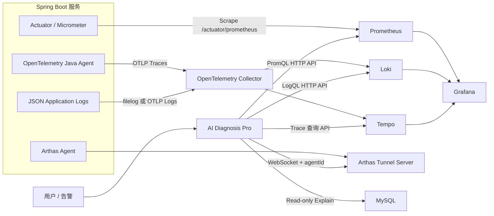

# AI Diagnosis Pro 全链路可观测诊断设计方案

> 版本：v1.0  
> 日期：2026-06-23  
> 状态：设计稿  
> 目标：在现有 Arthas、SQL Explain、AI Agent 诊断能力上，引入 Metrics、Logs、Traces 三类可观测证据，形成“发现异常 → 定位链路 → 关联日志 → JVM/SQL 深挖 → 汇总报告”的诊断闭环。

---

## 1. 背景与现状

当前项目已经具备以下能力：

- 以 `appId + env` 选择诊断目标。
- 通过 HTTP 或 Arthas Tunnel 定向执行 Arthas 命令。
- 通过 Tool Calling Agent 自主调用 dashboard、thread、trace、watch 等工具。
- 对捕获到的 SQL 执行只读 Explain 和元数据分析。
- 使用诊断任务、命令审计、持久化事件、SSE 和 AI 报告组织诊断流程。
- 通过知识库检索补充历史经验，但最终结论仍以实时证据为准。

当前不足：

- Arthas 只能看到单个 JVM 的当前状态，难以回答“异常从什么时候开始”“哪个实例先异常”。
- 缺少跨服务调用链，无法快速判断慢请求发生在入口服务、下游 RPC、数据库还是外部 HTTP。
- 日志与 Arthas、SQL 证据没有通过 `traceId` 关联。
- Agent 缺少历史时间窗和基线数据，容易在没有宏观证据时过早进入 JVM 深挖。
- 多种证据仍是独立输出，没有统一证据模型和可信度管理。

因此需要引入标准可观测体系，并将其作为 Agent 的受控只读工具集。

---

## 2. 建设目标

### 2.1 核心目标

形成以下自动诊断链路：

```text
用户问题 / 告警 / traceId
        ↓
确定应用、环境、实例和异常时间窗
        ↓
Prometheus 指标判断异常类型和影响范围
        ↓
Trace 定位慢节点、错误节点和上下游关系
        ↓
通过 traceId/spanId 查询关联日志
        ↓
对命中的 JVM 实例执行 Arthas 深度诊断
        ↓
必要时捕获 SQL 并执行 Explain
        ↓
融合 Metrics + Logs + Traces + Arthas + SQL
        ↓
生成带证据引用和置信度的诊断报告
```

### 2.2 非目标

第一阶段不建设：

- 通用 Grafana 替代品。
- 任意 PromQL、LogQL 或 TraceQL 的自然语言执行平台。
- 自动修改线上配置、自动重启服务或自动修复。
- 全量保存 Prometheus、Loki、Tempo 原始数据。
- 自研遥测采集协议或自研时序、日志、Trace 存储。

---

## 3. 推荐技术栈

| 数据类型 | 采集/协议 | 存储与查询 | 展示 |
| --- | --- | --- | --- |
| Metrics | Spring Boot Actuator + Micrometer | Prometheus | Grafana |
| Logs | JSON 日志 + OpenTelemetry Collector `filelog`/OTLP | Loki | Grafana |
| Traces | OpenTelemetry Java Agent + OTLP | Tempo | Grafana |
| 统一采集层 | OpenTelemetry Collector | 转换、过滤、批处理、采样 | Collector 自身指标 |
| JVM 深诊断 | Arthas Tunnel | 项目现有 Arthas 工具 | AI Diagnosis Pro |
| SQL 深诊断 | 项目现有 SQL Explain | MySQL 元数据与执行计划 | AI Diagnosis Pro |

采用 OpenTelemetry Collector 作为统一接入层，但 Prometheus 指标仍优先采用 Pull 模式抓取 `/actuator/prometheus`。这样符合 Spring Boot 与 Prometheus 的原生模型，也不会让业务应用直接依赖各后端实现。

后端存储可替换：

- 已有 ELK 时，日志提供方可实现 Elasticsearch 查询适配器。
- 已有 SkyWalking、Jaeger 或云 Trace 时，可实现对应 Trace 查询适配器。
- 项目内部统一依赖 `MetricsEvidenceProvider`、`LogEvidenceProvider` 和 `TraceEvidenceProvider`，不直接依赖具体产品。

---

## 4. 总体架构



### 4.1 架构职责

业务服务负责：

- 暴露标准指标。
- 生成 Trace，并传播 W3C Trace Context。
- 输出结构化日志，日志包含 `trace_id`、`span_id`。
- 注册 Arthas Tunnel，并保持唯一 `agentId`。

可观测基础设施负责：

- 采集、存储和查询遥测数据。
- 控制数据保留周期、采样、限流和租户隔离。
- 提供只读 HTTP API 给诊断系统。

AI Diagnosis Pro 负责：

- 决定查询什么证据，而不是存储全部遥测数据。
- 将查询限制在当前任务、应用、环境、实例和时间窗。
- 对证据进行摘要、持久化审计和关联。
- 根据宏观证据决定是否继续调用 Arthas、SQL 工具。

---

## 5. 统一标识与关联规范

Metrics、Logs、Traces、Arthas 必须使用同一组身份字段，否则无法可靠关联。

### 5.1 必备资源属性

| 标准属性 | 项目含义 | 示例 |
| --- | --- | --- |
| `service.name` | `appId` | `demo-service` |
| `service.instance.id` | 实例唯一 ID，建议与 `arthasAgentId` 一致 | `demo-service-01` |
| `deployment.environment.name` | 环境 | `dev` |
| `service.namespace` | 业务域或团队，可选 | `diagnosis-demo` |
| `service.version` | 发布版本 | `1.2.3` |
| `host.name` / `k8s.pod.name` | 运行位置 | `demo-pod-7f8c` |

第一阶段建议：

```text
app_instance.app_id          ↔ service.name
app_instance.env             ↔ deployment.environment.name
app_instance.arthas_agent_id ↔ service.instance.id
```

### 5.2 日志字段

所有业务日志至少包含：

```json
{
  "timestamp": "2026-06-23T20:00:00.123+08:00",
  "level": "ERROR",
  "service_name": "demo-service",
  "service_instance_id": "demo-service-01",
  "environment": "dev",
  "trace_id": "4bf92f3577b34da6a3ce929d0e0e4736",
  "span_id": "00f067aa0ba902b7",
  "logger": "com.example.OrderService",
  "thread": "http-nio-1234-exec-1",
  "message": "query order failed",
  "exception": "..."
}
```

约束：

- `trace_id`、`span_id` 不作为 Loki 高基数索引标签，保存在结构化元数据或日志内容中。
- Loki 索引标签只保留低基数字段，如 `service_name`、`environment`、`level`。
- 用户 ID、手机号、Token、Cookie、SQL 参数等必须在采集前脱敏。

### 5.3 Trace 传播

- 服务间统一采用 W3C `traceparent` 和 `tracestate`。
- HTTP、RestClient、WebClient、JDBC、Kafka 等由 OpenTelemetry 自动埋点优先处理。
- 异步线程池必须验证上下文传播；不能传播时使用显式包装器。
- 业务入口返回的错误响应可在安全范围内附带 `traceId`，便于用户直接发起诊断。

---

## 6. 被诊断 Spring Boot 服务接入

### 6.1 Metrics

依赖：

```xml
<dependency>
    <groupId>org.springframework.boot</groupId>
    <artifactId>spring-boot-starter-actuator</artifactId>
</dependency>
<dependency>
    <groupId>io.micrometer</groupId>
    <artifactId>micrometer-registry-prometheus</artifactId>
</dependency>
```

配置示例：

```yaml
management:
  endpoints:
    web:
      exposure:
        include: health,info,prometheus
  endpoint:
    health:
      probes:
        enabled: true
  metrics:
    tags:
      application: ${spring.application.name}
      environment: ${APP_ENV:dev}
      instance: ${ARTHAS_AGENT_ID:${HOSTNAME:local}}
    distribution:
      percentiles-histogram:
        http.server.requests: true
      slo:
        http.server.requests: 100ms,300ms,1s,3s
```

重点采集：

- HTTP 请求量、错误率、P95/P99 延迟。
- JVM CPU、进程 CPU、系统负载。
- 堆、非堆、直接内存。
- GC 次数和暂停时间。
- 活跃线程、阻塞线程。
- Tomcat 活跃线程、连接数。
- HikariCP 活跃、空闲、等待连接和超时。
- 自定义业务指标，如订单失败率、队列积压量。

禁止把 `traceId`、用户 ID、URL 原始参数等高基数值作为指标标签。

### 6.2 Traces

第一阶段推荐使用 OpenTelemetry Java Agent，无需修改大部分业务代码：

```bash
java \
  -javaagent:/opt/otel/opentelemetry-javaagent.jar \
  -Dotel.service.name=demo-service \
  -Dotel.resource.attributes=deployment.environment.name=dev,service.instance.id=demo-service-01 \
  -Dotel.exporter.otlp.endpoint=http://otel-collector:4318 \
  -Dotel.exporter.otlp.protocol=http/protobuf \
  -Dotel.traces.sampler=parentbased_traceidratio \
  -Dotel.traces.sampler.arg=0.1 \
  -jar demo-service.jar
```

开发环境可临时使用 100% 采样；生产默认建议 5%～10% 头部采样，并在 Collector 增加尾部采样策略：

- 错误 Trace 100% 保留。
- 延迟超过阈值的 Trace 100% 保留。
- 关键接口按规则提高采样率。
- 普通成功 Trace 按比例保留。

### 6.3 Logs

业务日志优先输出 JSON 到 stdout；本地 IDEA 环境可输出 JSON 文件，由 Collector `filelog` receiver 读取。

日志采集策略：

- 开发环境：采集 DEBUG 以上，保留时间较短。
- 测试环境：采集 INFO 以上。
- 生产环境：默认 INFO 以上，诊断时通过受控方式临时调整特定 logger。
- 异常堆栈必须作为单条结构化日志采集，避免多行拆分。
- 日志中自动注入 Trace/Span ID。

---

## 7. 可观测基础设施

### 7.1 Prometheus

Prometheus 抓取：

```yaml
scrape_configs:
  - job_name: spring-boot
    metrics_path: /actuator/prometheus
    scrape_interval: 15s
    static_configs:
      - targets:
          - host.docker.internal:1234
        labels:
          service_name: demo-service
          environment: dev
          service_instance_id: demo-service-01
```

生产环境应使用 Kubernetes、Consul 或文件服务发现，不手工维护所有实例。

保留策略建议：

- 本地/开发：7 天。
- 测试：15 天。
- 生产：30～90 天，长期指标通过 Thanos、Mimir 或远程存储扩展。

### 7.2 OpenTelemetry Collector

Collector 使用独立的 logs 和 traces pipeline：

```yaml
receivers:
  otlp:
    protocols:
      grpc:
        endpoint: 0.0.0.0:4317
      http:
        endpoint: 0.0.0.0:4318
  filelog:
    include:
      - /var/log/apps/*.json
    start_at: end

processors:
  memory_limiter:
    check_interval: 1s
    limit_mib: 512
  resource:
    attributes:
      - key: telemetry.sdk.pipeline
        value: diagnosis
        action: upsert
  batch:
    timeout: 5s
    send_batch_size: 1024

exporters:
  otlp/tempo:
    endpoint: tempo:4317
    tls:
      insecure: true
  otlphttp/loki:
    endpoint: http://loki:3100/otlp

service:
  pipelines:
    traces:
      receivers: [otlp]
      processors: [memory_limiter, resource, batch]
      exporters: [otlp/tempo]
    logs:
      receivers: [otlp, filelog]
      processors: [memory_limiter, resource, batch]
      exporters: [otlphttp/loki]
```

### 7.3 Grafana

Grafana 负责人工分析和基础设施验证：

- Prometheus 数据源：查看 RED、USE、JVM、数据库连接池。
- Loki 数据源：按服务、环境、实例和 traceId 查询日志。
- Tempo 数据源：查看调用瀑布图、关键 Span 和错误。
- 配置 Metrics → Trace exemplar、Trace → Logs 关联跳转。

AI Diagnosis Pro 不重复实现 Grafana 的通用探索能力，只展示与当前任务有关的证据摘要和深链接。

---

## 8. 诊断系统内部设计

### 8.1 新增模块

```text
observability/
├── config
│   ├── ObservabilityProperties
│   └── ObservabilityClientConfig
├── metrics
│   ├── MetricsEvidenceProvider
│   ├── PrometheusClient
│   └── PrometheusDiagnosticTools
├── logs
│   ├── LogEvidenceProvider
│   ├── LokiClient
│   └── LogDiagnosticTools
├── traces
│   ├── TraceEvidenceProvider
│   ├── TempoClient
│   └── TraceDiagnosticTools
├── evidence
│   ├── DiagnosisEvidence
│   ├── EvidenceService
│   ├── EvidenceSanitizer
│   └── EvidenceContextBuilder
└── orchestration
    ├── ObservabilityDiagnosisPlanner
    └── DiagnosticTargetResolver
```

### 8.2 Provider 接口

```java
public interface MetricsEvidenceProvider {
    MetricEvidence query(MetricQuery query);
}

public interface LogEvidenceProvider {
    LogEvidence query(LogQuery query);
}

public interface TraceEvidenceProvider {
    TraceEvidence getTrace(String traceId);
    List<TraceSummary> search(TraceSearchQuery query);
}
```

Provider 输出统一领域对象，不把 Prometheus、Loki、Tempo 原始响应直接暴露给 Agent。

### 8.3 查询安全模型

Agent 不允许自由生成任意 PromQL、LogQL 或 TraceQL。

采用“固定模板 + 受控参数”：

```text
queryHttpErrorRate(taskNo, windowMinutes)
queryHttpLatency(taskNo, uriPattern, windowMinutes)
queryJvmCpu(taskNo, windowMinutes)
queryJvmMemory(taskNo, windowMinutes)
queryGcPause(taskNo, windowMinutes)
searchErrorTraces(taskNo, uriPattern, windowMinutes)
searchSlowTraces(taskNo, uriPattern, thresholdMs, windowMinutes)
getTraceDetail(taskNo, traceId)
queryLogsByTraceId(taskNo, traceId)
queryErrorLogs(taskNo, keyword, windowMinutes, limit)
```

每个工具内部强制：

- 从 `taskNo` 获取 `appId/env`，模型不能切换目标。
- 时间窗默认 15 分钟，最大 24 小时。
- 日志单次最大 200 条。
- Trace 搜索单次最大 50 条。
- 指标查询步长根据时间窗自动计算。
- 查询、耗时、返回数量和截断信息全部审计。

高级管理员可提供只读查询控制台，但与 Agent 工具权限分离。

---

## 9. 统一证据模型

新增表 `diagnosis_evidence`：

```sql
CREATE TABLE diagnosis_evidence (
    id BIGINT PRIMARY KEY AUTO_INCREMENT,
    evidence_no VARCHAR(64) NOT NULL,
    task_no VARCHAR(64) NOT NULL,
    source_type VARCHAR(32) NOT NULL,
    evidence_type VARCHAR(64) NOT NULL,
    app_id VARCHAR(64) NOT NULL,
    env VARCHAR(32) NOT NULL,
    instance_id VARCHAR(128) DEFAULT NULL,
    trace_id VARCHAR(64) DEFAULT NULL,
    span_id VARCHAR(32) DEFAULT NULL,
    window_start DATETIME(3) DEFAULT NULL,
    window_end DATETIME(3) DEFAULT NULL,
    query_text TEXT DEFAULT NULL,
    summary_json JSON NOT NULL,
    raw_excerpt MEDIUMTEXT DEFAULT NULL,
    success TINYINT(1) NOT NULL,
    error_message VARCHAR(1000) DEFAULT NULL,
    cost_millis BIGINT NOT NULL,
    created_at DATETIME NOT NULL,
    UNIQUE KEY uk_evidence_no (evidence_no),
    KEY idx_evidence_task (task_no, source_type),
    KEY idx_evidence_trace (trace_id)
);
```

`source_type`：

- `METRICS`
- `LOGS`
- `TRACES`
- `ARTHAS`
- `SQL`
- `KNOWLEDGE`

统一证据 DTO：

```json
{
  "evidenceNo": "EVD-...",
  "sourceType": "METRICS",
  "evidenceType": "HTTP_LATENCY",
  "target": {
    "appId": "demo-service",
    "env": "dev",
    "instanceId": "demo-service-01"
  },
  "timeWindow": {
    "start": "2026-06-23T19:45:00+08:00",
    "end": "2026-06-23T20:00:00+08:00"
  },
  "summary": {
    "p95Ms": 2300,
    "baselineP95Ms": 180,
    "increaseRatio": 12.7
  },
  "success": true,
  "truncated": false
}
```

原始大结果不建议长期写入 MySQL。第一阶段只保存受限片段；后续可保存到对象存储，并在表中记录对象地址、哈希和保留时间。

---

## 10. 诊断任务与 API 调整

### 10.1 启动请求

扩展现有请求：

```json
{
  "appId": "demo-service",
  "env": "dev",
  "question": "订单接口从 19:50 开始变慢",
  "targetUri": "/orders/**",
  "mode": "TOOL_CALLING",
  "incidentTime": "2026-06-23T19:55:00+08:00",
  "lookbackMinutes": 15,
  "traceId": null,
  "evidenceSources": ["METRICS", "TRACES", "LOGS", "ARTHAS", "SQL"]
}
```

默认值：

- 未传 `incidentTime`：使用任务创建时间。
- 未传 `lookbackMinutes`：15 分钟。
- 最大时间窗：24 小时。
- 未传 `evidenceSources`：按诊断类型自动决定。

### 10.2 新增接口

```text
GET  /api/diagnose/tasks/{taskNo}/evidence
GET  /api/diagnose/tasks/{taskNo}/evidence/{evidenceNo}
GET  /api/diagnose/tasks/{taskNo}/observability-summary
POST /api/admin/observability/backends/{type}/test
GET  /api/admin/observability/backends
PUT  /api/admin/observability/backends/{type}
```

返回给前端的证据必须脱敏，不返回基础设施密码、完整内部 URL 或无限制原始日志。

---

## 11. Agent 诊断策略

### 11.1 总体顺序

```text
Metrics 定界
→ Traces 定位
→ Logs 解释
→ Arthas 验证 JVM 假设
→ SQL 验证数据库假设
→ 报告融合
```

### 11.2 慢请求

1. 查询目标 URI 的请求量、错误率、P95/P99。
2. 判断是所有实例变慢还是单实例变慢。
3. 搜索时间窗内慢 Trace。
4. 分析最慢 Span、错误 Span 和下游依赖。
5. 使用 traceId 查询关联日志。
6. 若慢点在当前 JVM 内部且证据不足，执行 Arthas trace。
7. 若慢点指向 JDBC/MyBatis，捕获 SQL 并执行 Explain。

### 11.3 CPU 高

1. Prometheus 判断 CPU 异常开始时间、持续时间和异常实例。
2. 对异常实例调用 Arthas dashboard、topThreads。
3. 查询对应时间窗内请求量、GC、线程数。
4. 使用 Trace 判断是否由特定接口流量或下游重试放大。
5. 日志查询死循环、重试、超时等模式。

### 11.4 内存异常

1. 查询 heap、non-heap、direct buffer、GC pause 和对象分配趋势。
2. 区分持续增长、瞬时尖峰和 GC 抖动。
3. 对异常实例执行 memory、jvm、dashboard。
4. 结合日志中的 OOM、GC overhead、连接池或缓存异常。
5. 第一阶段不自动执行 heapdump。

### 11.5 线程阻塞

1. 查询 Tomcat/Hikari 活跃与等待线程指标。
2. 查询 Trace 中长时间 Span 和下游超时。
3. 查询日志中的 timeout、deadlock、connection unavailable。
4. 对命中实例执行 thread、thread -b 和指定线程栈。

---

## 12. 报告结构

报告升级为：

```markdown
# 全链路智能诊断报告

## 1. 问题现象与影响范围
## 2. 异常时间窗
## 3. 指标证据
## 4. 调用链证据
## 5. 日志证据
## 6. JVM / Arthas 证据
## 7. SQL 证据
## 8. 跨证据关联
## 9. 根因分析与置信度
## 10. 推荐操作
## 11. 验证方案
## 12. 风险与证据缺口
```

引用格式：

```text
[M1] Prometheus：19:50 后 P95 从 180ms 上升到 2.3s
[T1] Tempo：慢 Trace 的 82% 耗时位于 order-db SELECT Span
[L1] Loki：同 traceId 出现 Hikari connection timeout
[A1] Arthas：目标线程阻塞在 HikariPool.getConnection
[S1] SQL Explain：订单表发生全表扫描
```

置信度规则：

- 高：至少两种独立实时证据相互印证。
- 中：存在明确单一证据，但缺少交叉验证。
- 低：只有间接趋势或知识库经验。
- 报告不得把时间相关性直接表述为因果关系。

---

## 13. 前端设计

### 13.1 诊断输入

新增：

- 异常时间：默认当前时间。
- 回看范围：5、15、30、60 分钟。
- Trace ID：可选。
- 证据源：默认自动，可高级选择。

### 13.2 诊断过程

现有流程节点扩展为：

```text
识别意图
→ 指标分析
→ Trace 分析
→ 日志关联
→ Arthas 深挖
→ SQL 分析
→ 报告生成
```

每个节点展示：

- 查询目标与时间窗。
- 查询状态和耗时。
- 证据摘要。
- 跳转 Grafana Explore 的深链接。
- 失败时说明是“无数据”“查询失败”还是“权限不足”。

### 13.3 报告页面

- 展示时间线。
- 展示服务调用拓扑。
- 展示异常实例对比。
- 指标图标记 Trace exemplar。
- 点击 traceId 展开 Span 和关联日志。
- 保持当前 Markdown 报告下载能力。

---

## 14. 配置设计

```yaml
diagnosis:
  observability:
    enabled: true
    default-lookback-minutes: 15
    max-lookback-hours: 24
    metrics:
      enabled: true
      provider: PROMETHEUS
      base-url: ${PROMETHEUS_BASE_URL:http://127.0.0.1:9090}
      query-timeout-ms: 5000
      max-series: 100
    logs:
      enabled: true
      provider: LOKI
      base-url: ${LOKI_BASE_URL:http://127.0.0.1:3100}
      query-timeout-ms: 8000
      max-lines: 200
    traces:
      enabled: true
      provider: TEMPO
      base-url: ${TEMPO_BASE_URL:http://127.0.0.1:3200}
      query-timeout-ms: 8000
      max-traces: 50
    grafana:
      base-url: ${GRAFANA_BASE_URL:http://127.0.0.1:3000}
```

认证信息不写入明文配置默认值，应使用环境变量、Secret 或现有 AES-GCM 加密机制。

---

## 15. 安全与治理

- 所有可观测查询客户端使用只读账号。
- Agent 不接收用户提供的任意后端地址。
- PromQL、LogQL、TraceQL 使用模板生成并限制参数。
- 限制时间窗、结果条数、响应大小、并发数和每任务调用次数。
- 日志查询结果进入模型前执行敏感数据脱敏。
- 诊断任务必须校验 `taskNo + appId + env`。
- 生产环境默认禁止 Agent 动态调整 logger、采样率或服务配置。
- 记录每次查询的模板、参数、调用人、任务、耗时和结果摘要。
- Grafana、Prometheus、Loki、Tempo 不直接暴露公网。
- `/actuator/prometheus` 通过管理网络、ServiceMonitor 或反向代理保护。

---

## 16. 可用性与性能

- Metrics、Logs、Traces 查询相互隔离，单个证据源失败不应直接导致整个任务失败。
- 查询失败时继续使用其余证据，并在报告中说明证据缺口。
- 每任务最多并发 3 个只读可观测查询。
- 对相同任务、查询模板和时间窗做短期缓存。
- Collector 启用 `memory_limiter`、`batch`、发送队列和重试。
- AI 上下文只注入摘要和关键样本，不注入大量原始日志或完整 Trace JSON。
- 原始日志先规则聚类，再选择代表样本。

---

## 17. 监控诊断系统自身

AI Diagnosis Pro 自身也必须接入同一可观测体系，增加指标：

```text
diagnosis_tasks_total{status,type}
diagnosis_task_duration_seconds
diagnosis_tool_calls_total{source,tool,status}
diagnosis_observability_query_duration_seconds{source,query_type}
diagnosis_observability_query_failures_total{source,reason}
diagnosis_evidence_items_total{source,type}
diagnosis_ai_report_duration_seconds
diagnosis_ai_token_usage_total{stage,model}
arthas_tunnel_connections_total{status}
```

同时传播诊断任务自身的 traceId，使一次诊断任务的 Prometheus、Loki、Tempo、Arthas 和 AI 调用也可被追踪。

---

## 18. 测试方案

### 18.1 单元测试

- PromQL/LogQL 模板生成及参数转义。
- 时间窗与结果上限。
- taskNo 与目标应用绑定校验。
- Prometheus、Loki、Tempo 响应解析。
- 日志脱敏。
- Trace 与日志关联。
- 统一证据持久化与上下文截断。
- 部分证据源失败时的降级行为。

### 18.2 集成测试

使用 demo-service 制造：

- 正常请求。
- 固定延迟请求。
- 下游 HTTP 超时。
- SQL 慢查询。
- CPU 密集任务。
- 线程阻塞。
- 内存增长。
- 业务异常。

验证：

1. Prometheus 能看到对应指标变化。
2. Tempo 能看到跨服务调用链。
3. Loki 能用 traceId 找到关联日志。
4. Agent 能选择正确实例调用 Arthas。
5. SQL 慢节点能进入 Explain。
6. 报告中的时间、实例、Trace、日志和 Arthas 证据一致。

### 18.3 验收标准

- 指定 traceId 时，10 秒内返回 Trace 与关联日志摘要。
- 15 分钟指标分析在 5 秒内完成。
- 单个证据源不可用时任务仍可继续并明确提示。
- Agent 不得查询其他应用或环境。
- 报告中每个关键结论至少引用一个实时证据编号。
- 典型慢请求场景能定位到正确服务、Span 和 SQL/JVM 节点。

---

## 19. 分阶段实施

### Phase 1：基础遥测

- demo-service 接入 Actuator、Prometheus 和 OTel Java Agent。
- 部署 Prometheus、Loki、Tempo、Grafana、Collector。
- 打通 service/instance/env/traceId 标识。
- 验证 Grafana 中 Metrics、Logs、Traces 可互相跳转。

### Phase 2：诊断系统只读查询

- 增加 Prometheus、Loki、Tempo 客户端。
- 增加受控查询工具。
- 增加统一证据表和 SSE 事件。
- 前端展示三类证据摘要。

### Phase 3：Agent 编排

- 修改 Agent Prompt 和诊断计划。
- 实现 Metrics → Trace → Logs → Arthas → SQL 的策略。
- 升级报告结构和置信度模型。

### Phase 4：生产治理

- Tail Sampling。
- 查询限流与缓存。
- 多租户和权限隔离。
- 长期存储与对象存储。
- 告警触发自动创建预诊断任务。

---

## 20. 推荐的第一期最小闭环

第一期只实现一个典型场景：“接口慢”：

1. demo-service 暴露 Prometheus 指标。
2. OTel Agent 上报 Trace 到 Tempo。
3. JSON 日志进入 Loki，并包含 traceId。
4. 用户选择 `demo-service/dev`，输入 URI 和异常时间。
5. Agent 查询该 URI 的 P95/P99。
6. 搜索最慢 Trace。
7. 查询该 Trace 的日志。
8. 对 `demo-service-01` 执行 Arthas trace。
9. 若命中 SQL，再执行 Explain。
10. 生成跨 Metrics、Trace、Logs、Arthas、SQL 的报告。

完成该闭环后，再扩展 CPU、内存和线程问题。这样能最早验证跨证据关联是否真正产生诊断价值。

---

## 21. 参考资料

- [Spring Boot Metrics 与 Prometheus](https://docs.spring.io/spring-boot/reference/actuator/metrics.html#actuator.metrics.export.prometheus)
- [Spring Boot Tracing](https://docs.spring.io/spring-boot/reference/actuator/tracing.html)
- [OpenTelemetry Java 自动埋点](https://opentelemetry.io/docs/zero-code/java/agent/)
- [OpenTelemetry Collector Architecture](https://opentelemetry.io/docs/collector/architecture/)
- [Loki 使用 OpenTelemetry Collector 接收日志](https://grafana.com/docs/loki/latest/send-data/otel/)
- [Tempo 使用 OTLP Collector](https://grafana.com/docs/tempo/latest/set-up-for-tracing/instrument-send/set-up-collector/grafana-alloy/)
- [Prometheus HTTP API](https://prometheus.io/docs/prometheus/latest/querying/api/)

